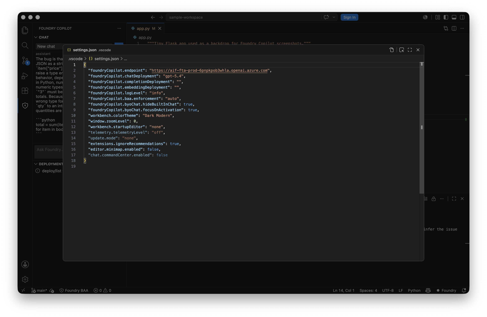
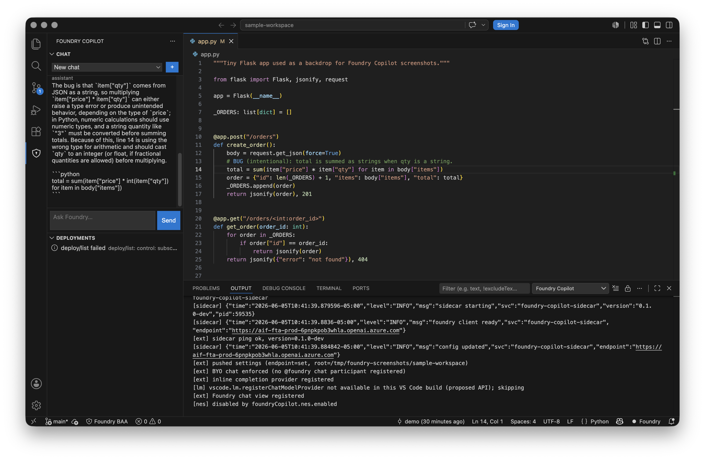
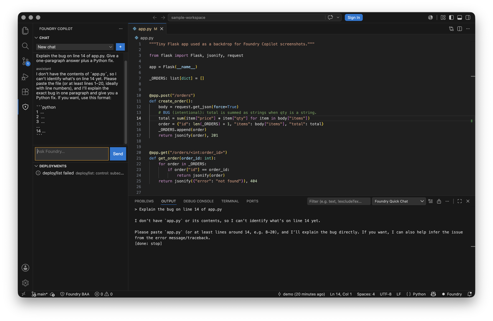
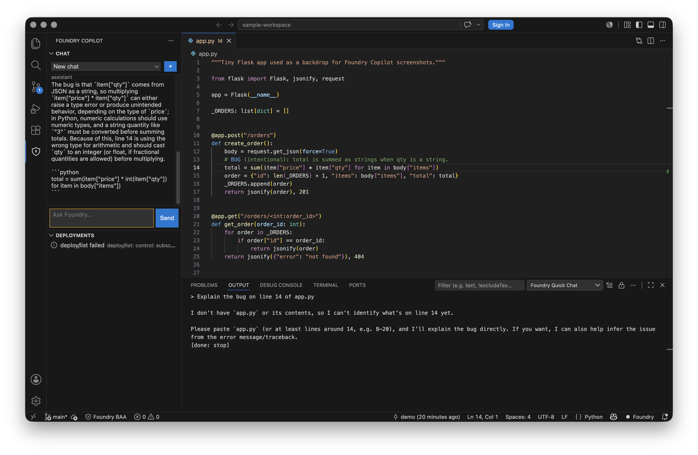
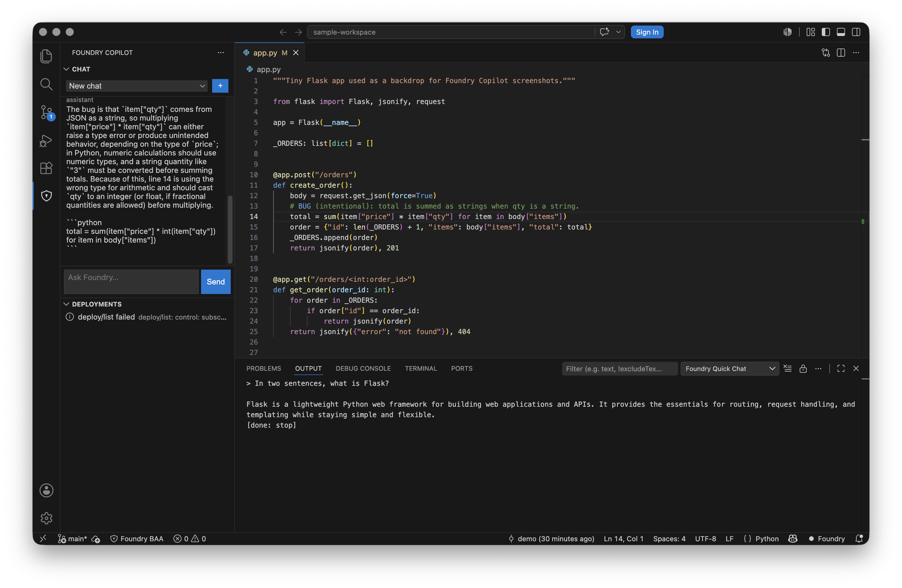
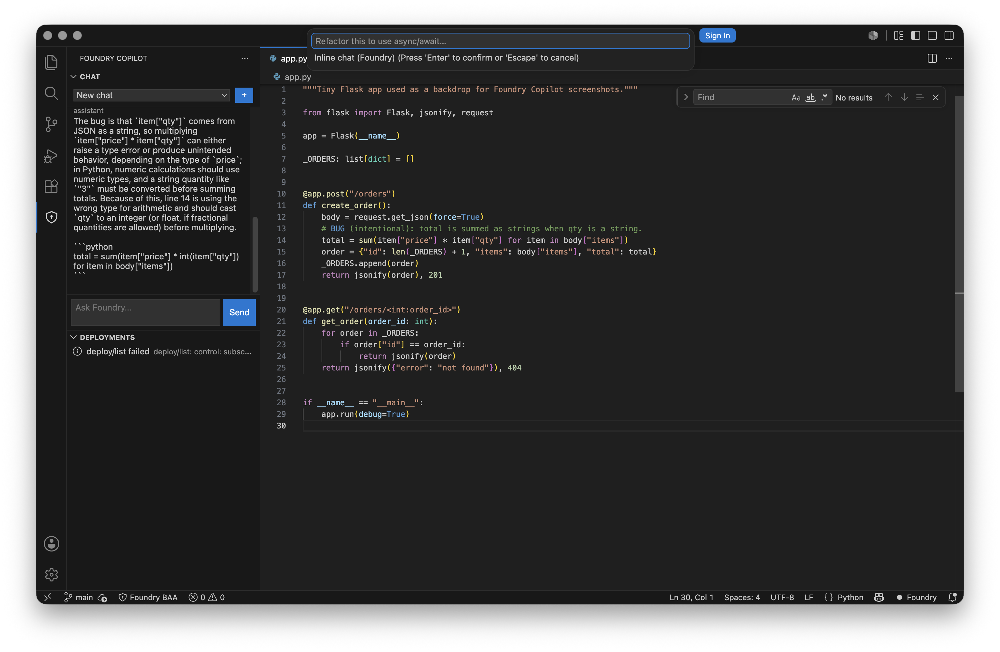

# Foundry Copilot — Chat User Guide

> Companion to [USER_GUIDE.md](USER_GUIDE.md) and [VISUAL_TOUR.md](VISUAL_TOUR.md).
> This guide walks through **chat specifically**: connecting to a Foundry
> endpoint, sending your first prompt, the three chat surfaces, and what to
> do when something is wrong.

Foundry Copilot ships **its own chat surface**. There is no fall-through to
GitHub Copilot Chat: every prompt is routed to your Microsoft Foundry /
Azure OpenAI deployment over a hard-locked HTTPS transport, signed with your
Entra ID bearer token. If you misconfigure the endpoint, the sidecar will
refuse to send rather than leak.

---

## 1. Prerequisites

Before chat can work end-to-end you need three things:

| # | Thing | How to verify |
|---|-------|---------------|
| 1 | A **Microsoft Foundry / Azure OpenAI resource** with at least one chat deployment (e.g. `gpt-5.4`, `gpt-4o`). | `az cognitiveservices account deployment list --resource-group <rg> --name <account>` |
| 2 | **Entra ID sign-in** on the same machine — the sidecar uses `DefaultAzureCredential`, so `az login` is enough. | `az account show` returns your tenant/sub |
| 3 | A role on the resource that grants `Cognitive Services OpenAI User` (or higher). Without it, every chat returns HTTP 401. | `az role assignment list --assignee <you> --scope <resource-id>` |

If you don't have a deployment yet, create one:

```bash
az cognitiveservices account deployment create \
  --resource-group <rg> \
  --name <account> \
  --deployment-name gpt-5.4 \
  --model-format OpenAI \
  --model-name gpt-5.4 \
  --model-version "2024-12-01" \
  --sku-capacity 10 --sku-name Standard
```

---

## 2. Connect the extension to your endpoint

The extension reads three workspace settings; only the first two are needed
for chat. Open **`Preferences: Open Workspace Settings (JSON)`** and add:

```jsonc
{
  // ⚠ The endpoint MUST end in one of:
  //    .openai.azure.com         ← classic Azure OpenAI
  //    .services.ai.azure.com    ← Foundry projects
  //    .cognitiveservices.azure.com
  //    .inference.ml.azure.com
  // Anything else is rejected by the sidecar's hard lock before a request is even built.
  "foundryCopilot.endpoint":        "https://<your-resource>.openai.azure.com",
  "foundryCopilot.chatDeployment":  "gpt-5.4",

  // Optional for chat, used by other surfaces:
  "foundryCopilot.completionDeployment":  "",   // inline completions
  "foundryCopilot.embeddingDeployment":   ""    // workspace RAG
}
```



When you save, the extension calls `config/set` against the sidecar. The
sidecar persists the new endpoint to `~/.foundry-copilot/config.yaml` **and
rebuilds its Foundry client** so the very next chat turn picks up the
change — you do not need to reload the window.

> If you'd rather configure the sidecar directly (e.g. for the standalone
> TUI), edit `~/.foundry-copilot/config.yaml`:
>
> ```yaml
> endpoint: https://<your-resource>.openai.azure.com
> chat_deployment: gpt-5.4
> ```

### Verify the connection

Run **`Foundry Copilot: Ping Sidecar`** from the command palette. You should
see a `Foundry Copilot sidecar OK` toast and the status bar should read
`Foundry` (not `Foundry BAA: …`):



The bottom Output panel above (open it with **`Foundry Copilot: Show Output
Channel`**) is your truth source. Each successful turn logs roughly:

```text
INFO  config updated         endpoint=https://aif-fta-prod-...openai.azure.com
INFO  foundry client rebuilt endpoint=https://aif-fta-prod-...openai.azure.com
INFO  chat/start             stream=<id> messages=2
INFO  chat/chunk             stream=<id> finish=stop
```

If the log says `foundry client not configured`, the endpoint never landed —
re-check the JSON and look for a 4xx in the `config/set` line.

---

## 3. The three chat surfaces

| Surface | Where it lives | When to use it |
|---------|----------------|----------------|
| **Chat view** | Activity bar → Foundry Copilot icon | Multi-turn conversations, persistent threads, the everyday workhorse |
| **Quick Chat** | `Foundry Copilot: Quick Chat` (Cmd/Ctrl-Shift-P) | One-shot questions; result appears as a notification |
| **Inline Chat** | `Foundry Copilot: Inline Chat` (Cmd/Ctrl-Alt-I) | "Edit this code" — produces a *proposal* you can preview/apply |

### 3.1 Chat view — your first prompt

Open the activity bar's **Foundry Copilot** icon, click **`+`** to create a
thread, type a question, and hit Enter:



Streaming works like every other modern LLM UI: tokens land in the assistant
bubble as soon as the sidecar receives `chat/chunk` notifications. When the
turn finishes, the input box clears and the thread title persists under the
dropdown for as long as the workspace exists.

#### Multi-turn

Threads are local-first: every user/assistant message is stored under
`globalStorage/threads.json` keyed by thread id. On the next turn the
sidecar replays the entire history to Foundry — so the model has full
context, but you can drop a thread at any time without leaking state:



Above, the second turn pasted the actual buggy line and the model produced a
diagnosis ("`item["qty"]` arrives from JSON as a string …") plus a Python
fix as a fenced code block.

### 3.2 Quick Chat — one-shot questions

Run **`Foundry Copilot: Quick Chat`**, type, press Enter. The whole turn
runs through `complete/inline` (not `chat/start`), so there is no thread to
manage — you just get the answer back as a VS Code information notification:



Use Quick Chat for tooltip-style questions: "what does this acronym mean",
"shell command for X", "regex for Y". For anything you'll want to follow up
on, use the chat view instead.

### 3.3 Inline Chat — propose-and-apply edits

Open a file, put the cursor where you want the change, run **`Foundry
Copilot: Inline Chat`** (Cmd/Ctrl-Alt-I), and describe the edit:



When the model finishes, the extension calls `chat/edit_propose` and shows
a modal with the change summary plus three buttons:

| Button | What happens |
|--------|--------------|
| **Apply** | The proposed text replaces the selection via `workspace.applyEdit`. Undo (Cmd/Ctrl-Z) reverts it like any other edit. |
| **Show diff** | Opens a side-by-side `vscode.diff` view of the proposed change — review before applying. |
| **Cancel** | Drops the proposal. Nothing is written. |


> Inline chat never streams. The full proposal is constructed server-side
> and returned as one blob so the modal can show a single, atomic edit.

---

## 4. Keyboard shortcuts

| Action | macOS | Windows / Linux |
|--------|-------|-----------------|
| Inline Chat | `⌘⌥I` | `Ctrl+Alt+I` |
| Quick Chat | (palette) | (palette) |
| Send a chat-view message | `Enter` | `Enter` |
| Newline inside the chat-view input | `Shift+Enter` | `Shift+Enter` |
| Focus the Foundry chat view | (palette: `Foundry Copilot Chat: Focus`) | (palette) |

---

## 5. Where the data goes

For each chat turn the extension does **exactly one** of:

```text
chat/start          → POST {endpoint}/openai/deployments/{chatDeployment}/chat/completions?api-version=2024-10-21
complete/inline     → POST {endpoint}/openai/deployments/{chatDeployment}/chat/completions?api-version=2024-10-21
chat/edit_propose   → POST {endpoint}/openai/deployments/{chatDeployment}/chat/completions?api-version=2024-10-21
```

There is no other outbound network call from the chat surfaces. The host
must match the allow-list above; if it doesn't, the sidecar's
`LockedTransport` returns a refused connection before the request even hits
DNS. See [`core/internal/foundry/lock.go`](../core/internal/foundry/lock.go).

Bearer tokens come from `DefaultAzureCredential` (so `az login`,
`AZURE_CLIENT_ID`+`AZURE_CLIENT_SECRET`, managed identity, etc. all work)
and are scoped to `https://cognitiveservices.azure.com/.default`.

---

## 6. Troubleshooting

| Symptom | Likely cause | Fix |
|---------|--------------|-----|
| `(error) foundry client not configured` in the chat thread | `foundryCopilot.endpoint` is empty (or hasn't reached the sidecar yet) | Set the workspace setting; the sidecar rebuilds the client on `config/set`. Confirm via the Output channel. |
| `(error) request body missing "model" field` | The endpoint is set but `foundryCopilot.chatDeployment` is empty | Add `"foundryCopilot.chatDeployment": "<name>"` and save. |
| `(error) lock: host not allow-listed: <host>` | The endpoint domain doesn't end in an Azure / Foundry suffix | Use the resource's official endpoint, not a proxy. |
| `(error) 401 Unauthorized` | Entra session is missing the right RBAC role | `az role assignment create … --role "Cognitive Services OpenAI User" --scope <resource-id>` |
| `(error) 404 Resource not found` | Deployment name doesn't exist in the target resource | List with `az cognitiveservices account deployment list`; match exactly (case-sensitive). |
| Status bar shows `Foundry BAA: GitHub.copilot` | A conflicting GitHub Copilot extension was detected | Run `Foundry Copilot: Disable Conflicting Extensions` or set `foundryCopilot.baa.enforcement` to `auto`. |
| Quick Chat says `Foundry replied` but no answer text | The model returned an empty completion (rare; usually a content filter) | Re-run with a different prompt; check the Output channel for `finish_reason=content_filter`. |
| Inline Chat modal never appears | The model returned no diff-able edit (often because the prompt was conversational, not imperative) | Re-prompt with an imperative verb: "Replace …", "Add …", "Refactor … to …". |

When you file a bug, attach the relevant slice of the **Foundry Copilot**
output channel (it's already redacted — tokens never appear in logs).

---

## 7. What's intentionally *not* in chat

Foundry Copilot's chat is deliberately small. The following are not chat
features today and aren't on the near-term roadmap:

- **File-context attachments.** The extension does not silently slurp the
  editor selection into your prompt. Paste the snippet you want analyzed,
  or use Inline Chat where the selection is the prompt.
- **Workspace-wide RAG by default.** Embeddings are opt-in via
  `foundryCopilot.embeddingDeployment` + `Foundry Copilot: Refresh Index`.
- **Tool use from the chat view.** Tool use lives behind the `@foundry
  /agent` slash command in a separate surface — chat stays a pure chat.
- **Routing to GitHub Copilot.** Even if it's installed, the BAA guard
  disables it on activation.

The point is to keep the wire shape boring: one chat completion per turn,
to one tenant-owned deployment, signed with one identity. If you see a
network call you can't explain in the output channel, that's a bug — please
file it.
