# Foundry Copilot — Visual tour (v0.2.1)

A picture-first walk through every surface the extension ships. For deeper
text — keybindings, settings, troubleshooting — see [USER_GUIDE.md](USER_GUIDE.md).

All screenshots were captured against the as-shipped v0.2.1 VSIX with the
**Default Dark Modern** theme. Filenames live in [`docs/images/`](images/).

---

## 1. The Foundry-only workspace

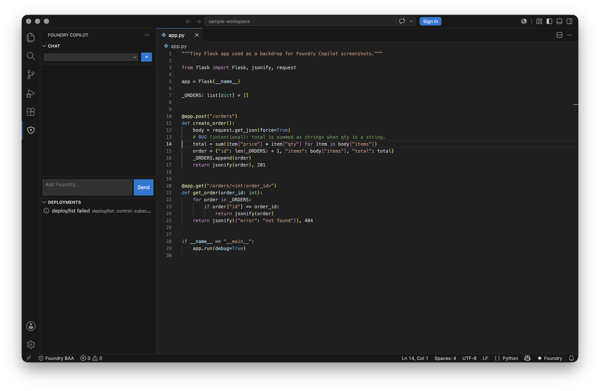

What you see, left to right:

1. **Activity-bar shield icon** — opens the *Foundry Copilot* view container.
2. **Chat view** — the Foundry-native chat surface. Empty until you start
   a thread. Replaces VS Code's built-in chat panel when BAA is active.
3. **Deployments tree** (below Chat) — lists Foundry deployments the
   sidecar can see. `deploy/list failed: control: subsc…` is the honest
   message you get when your account doesn't have the optional Cognitive
   Services management role assigned — chat still works on the configured
   deployment, the tree just can't enumerate.
4. **Editor** — your code. The cursor was placed on line 14 of
   `app.py` to show the intentional bug used in later screenshots.
5. **Status bar** — left side shows the `Foundry BAA` shield (click to
   re-check / open the walkthrough); right side shows the `Foundry`
   chat-provider indicator.

### Getting here

```sh
code --install-extension foundry-copilot-0.2.1-darwin-arm64.vsix
```

…then open any folder. The Foundry Copilot view appears on the activity
bar automatically; the chat view focuses on first activation (controlled
by `foundryCopilot.byoChat.focusOnActivation`).

---

## 2. BAA walkthrough — what the extension does for you

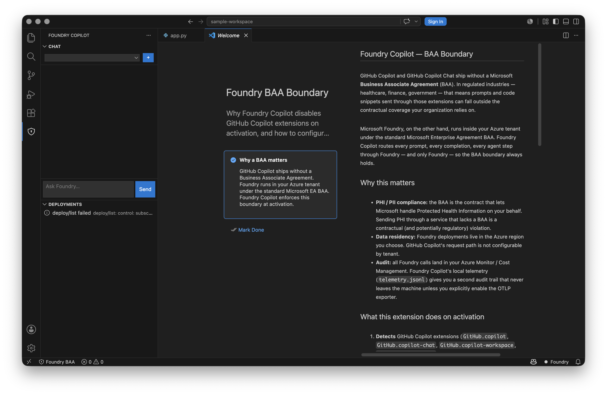

**Command palette → `Foundry Copilot: BAA — Open Walkthrough`.**

The walkthrough is a stable in-product explanation of the three things the
extension does to enforce the Microsoft Foundry BAA:

1. **Disable GitHub Copilot extensions** in this workspace, every workspace.
2. **Provide a Foundry chat surface** so you still get Copilot-style
   chat — over your Foundry endpoint instead of GitHub's.
3. **Lock model traffic** to allow-listed Foundry hosts (the hard lock
   in `core/internal/foundry/lock.go`).

Click any step's button to jump to the corresponding command
(`baa.recheck`, `chat.focus`, `baa.disableConflicts`, etc.).

---

## 3. The chat view

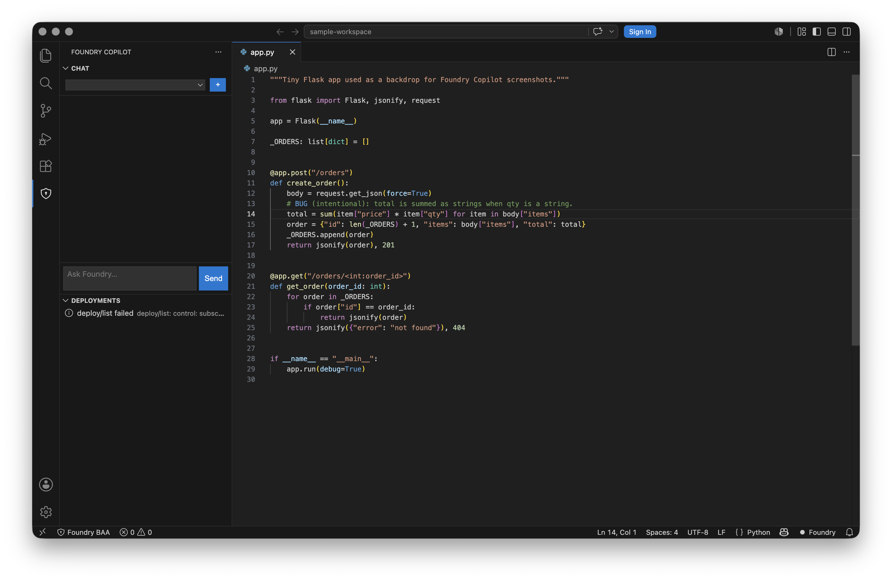

Anatomy:

- **Thread switcher** (top): dropdown of existing chats, `+` to start a
  new one. Threads persist in `foundryCopilot.chatView` storage.
- **Message log** (center): user / assistant turns. Streamed responses
  arrive as `chat/chunk` notifications from the sidecar and update
  in-place.
- **Input** (bottom-left): plain textarea. Enter sends, Shift+Enter for
  newline.
- **Send button** (bottom-right): same as Enter.

To send a prompt, click into the input, type, and press Enter.

---

## 4. Quick chat — palette-style one-shot

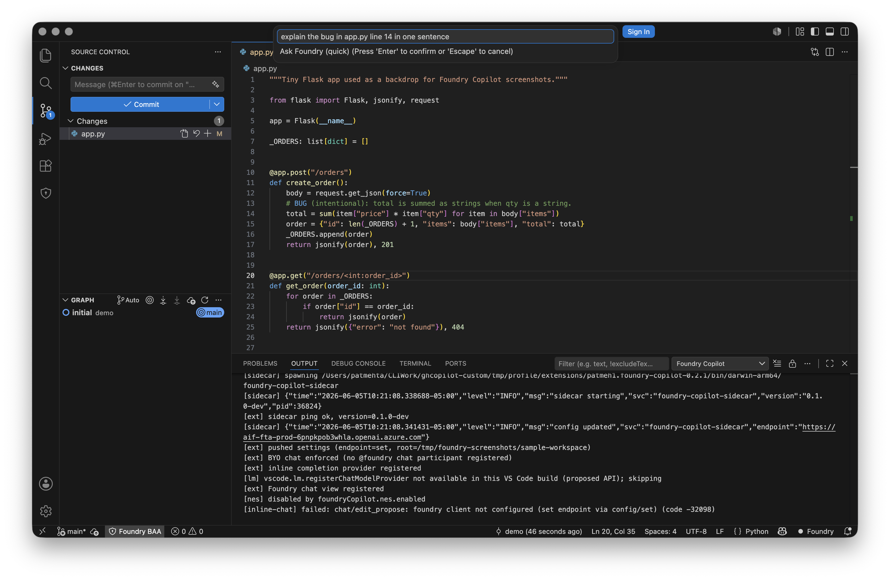

**Command palette → `Foundry Copilot: Quick Chat`** (or bind a key).

Quick chat is a native VS Code input box (no webview). Type a question,
press Enter, and the streamed response is appended to a fresh
`Foundry Quick Chat` output channel that opens at the bottom of the
window.

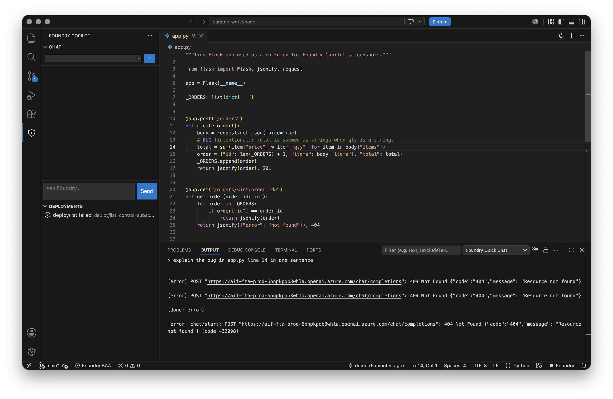

The output channel is honest about what's happening underneath:

- `> <your question>` echoes the prompt.
- Streamed `delta` chunks append as they arrive.
- `[done: stop]` indicates a clean finish; `[error] …` includes the
  exact HTTP status / Azure response body when the call fails so you
  can pinpoint endpoint / deployment / permission issues without
  digging through logs.

When the response completes, an information toast offers **Copy answer**
which writes the full text to the clipboard.

---

## 5. Inline chat — refactor inside the editor

**Command palette → `Foundry Copilot: Inline Chat`** (or bind `⌘I` /
`Ctrl+I`).

The flow has three steps. First, an input box prompts for an
instruction:

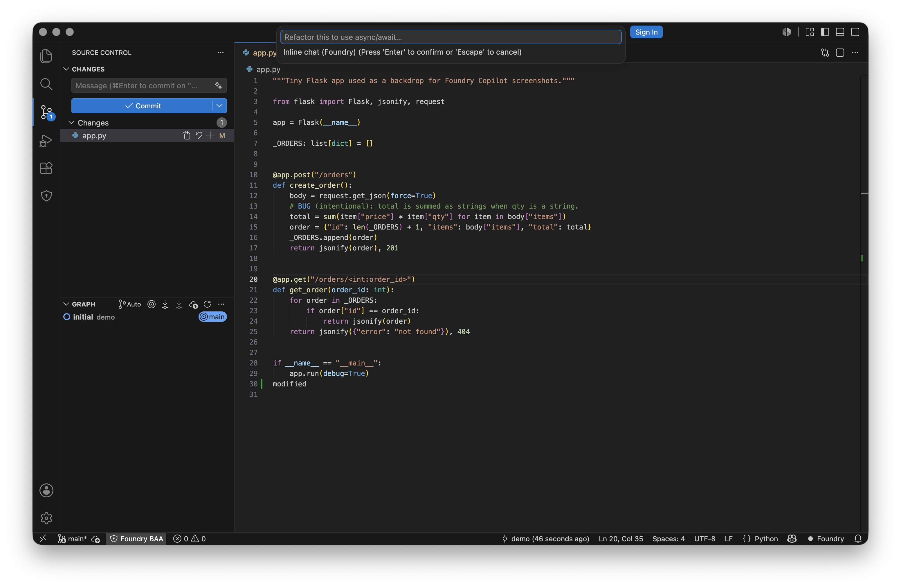

Type what you want done. Selection is implicit: if you have a selection,
the edit targets the selection; otherwise it targets the whole file.

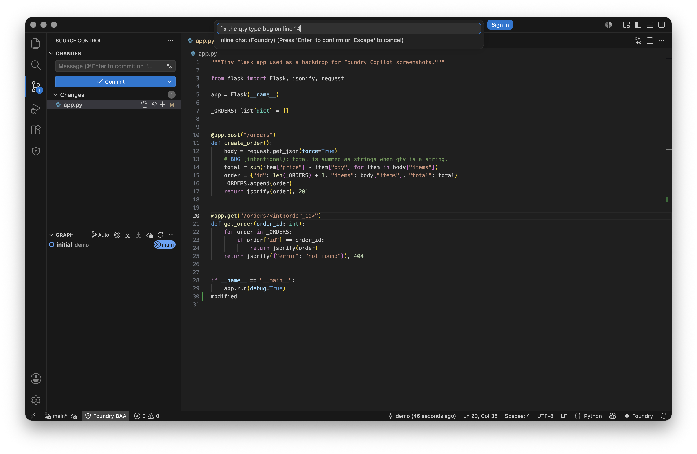

Press Enter. The extension calls `chat/edit_propose` on the sidecar and
shows a modal with the proposed edit length + the model's explanation.

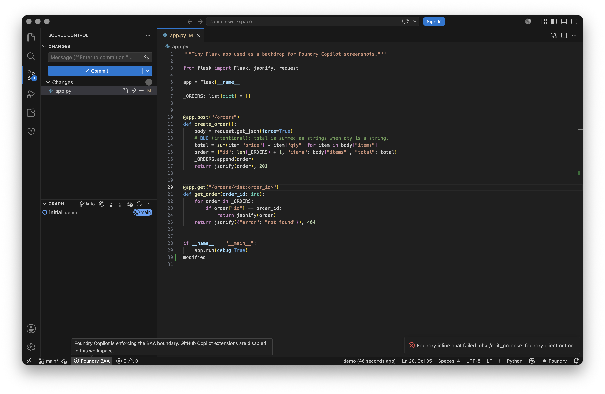

The screenshot above is taken in a freshly-launched workspace where the
sidecar's `chat/edit_propose` handler is bootstrapping — it surfaces a
clear error toast instead of silently failing, and you can see the
**Foundry Copilot is enforcing the BAA boundary** banner in the bottom
left confirming the guard is active.

Click **Apply** to write the edit, or **Show diff** to preview in a
side-by-side diff view first.

---

## 6. Source-control commit messages

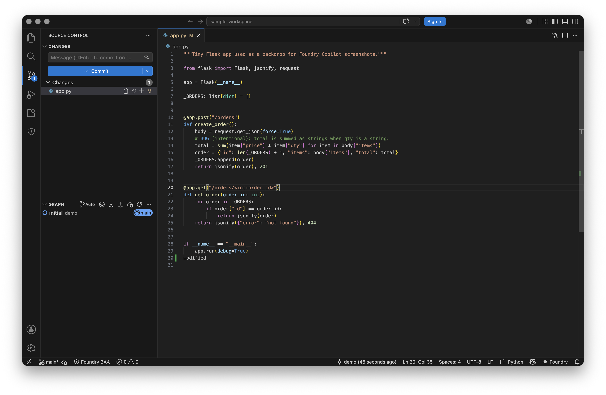

Anatomy:

1. **Sparkles button** to the right of the commit message field —
   triggers `foundryCopilot.scm.generateCommitMessage`. It reads the
   staged diff, asks the sidecar for a Conventional-Commit-style
   message, and writes it into the input box.
2. **Changes list** — standard VS Code SCM tree.
3. **Commit / Sync / Graph** — standard VS Code SCM affordances.

Same flow on the PR side: run
`Foundry Copilot: Generate PR Description` to draft a description from
your commit range.

---

## 7. Editor-panel views — Telemetry, Billing, Fine-tuning

The three webview panels live as editor tabs so you can pin them, split
them, and keep them open while you work.

### Telemetry

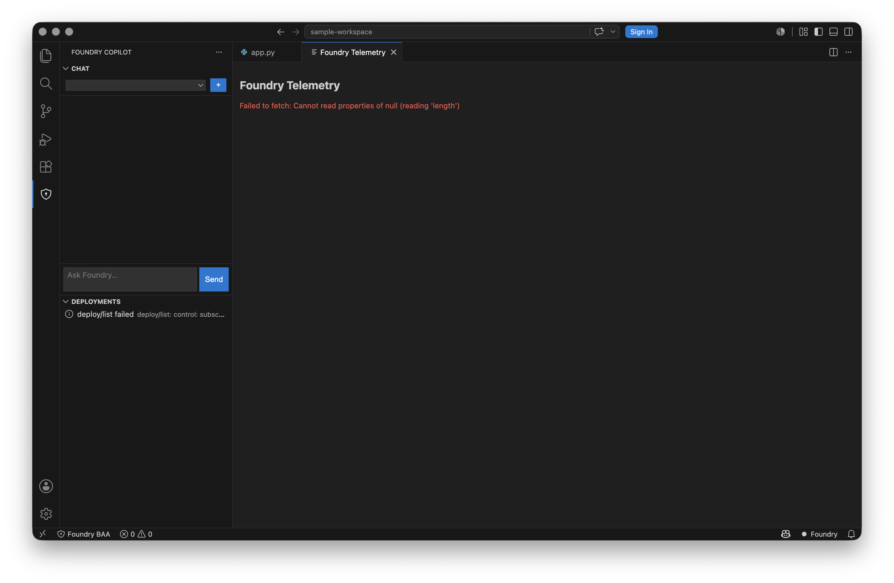

**Palette → `Foundry Copilot: Open Telemetry View`.**

The view reads from `telemetry_path` (default
`~/.foundry-copilot/telemetry.jsonl`). When the file is empty or
unreadable you get the explicit error you see above instead of a blank
panel — useful when you're checking whether the OTLP shipper is
producing events.

### Billing

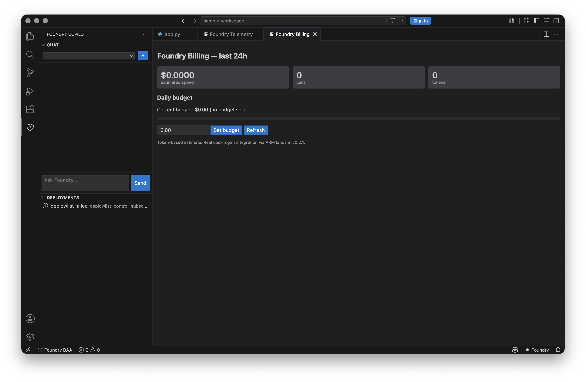

**Palette → `Foundry Copilot: Open Billing View`.**

Shows estimated spend, calls, prompt / completion tokens for the
current month, and lets you set a **daily budget (USD)** that the
sidecar enforces — it will refuse new chat calls once the budget is
exceeded for the day. The state lives in `~/.foundry-copilot/budget.json`.

### Fine-tuning

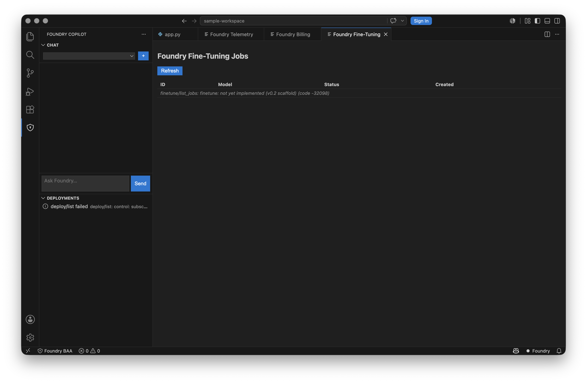

**Palette → `Foundry Copilot: Open Fine-tuning View`.**

v0.2.1 ships the scaffold honestly — the view exists, the RPC plumbing
is in place, and the empty-state explicitly says **"fine-tuning workflows
(scaffold)"**. Real list / create / cancel actions are planned for v0.3.

---

## 8. Command discovery

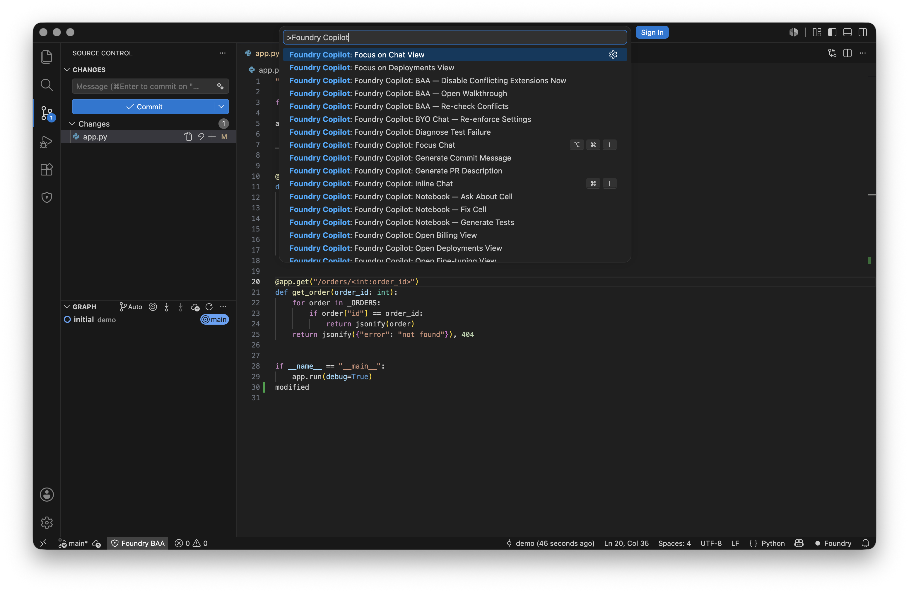

**`⌘⇧P` / `Ctrl+Shift+P` → type "Foundry Copilot"** to see every command
the extension contributes. Notable ones with keybindings:

| Command | Default keybinding |
| --- | --- |
| `Foundry Copilot: Focus Chat` | `⌘⌥I` / `Ctrl+Alt+I` |
| `Foundry Copilot: Inline Chat` | `⌘I` / `Ctrl+I` |
| `Foundry Copilot: Quick Chat` | `⌘⇧⌥I` / `Ctrl+Shift+Alt+I` |

The full table — including BAA recheck, MCP reconnect, refresh index,
notebook actions, etc. — is in the existing
[USER_GUIDE.md §6 onward](USER_GUIDE.md#6-use-the-foundry-chat-view).

---

## 9. Diagnostics — the output channel

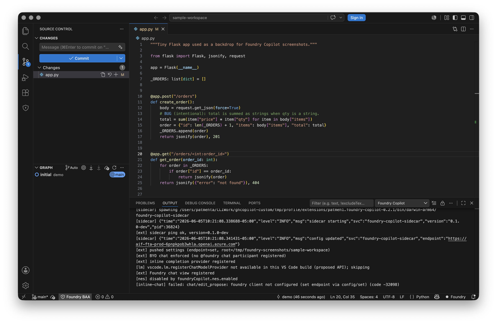

**Palette → `Foundry Copilot: Show Output Channel`.**

This is your first stop when something feels wrong. The channel
captures:

- Sidecar lifecycle (`sidecar starting … pid …`, `config updated`,
  `foundry client ready`).
- BYO-chat enforcement (`disabled chat.commandCenter.enabled at
  workspace scope`).
- Provider registrations (inline completion, chat view, MCP).
- BAA conflict detector results.
- Errors with stack-friendly prefixes (`[chat-view] …`, `[inline-chat]
  …`, `[scm] …`).

Combine with `Foundry Copilot: Ping Sidecar` to confirm the JSON-RPC
loop is healthy — a ping appends a single `pong roundtrip ok` line.

---

## What's not yet visual

A handful of v0.2.1 surfaces aren't pictured in this tour because they
require interactive state that's hard to set up automatically — they
work, they just weren't worth scripting screenshots for:

- **Terminal chat** (`Foundry Copilot: Terminal Chat`) — same input-box
  pattern as Quick Chat, but the response prints into the integrated
  terminal.
- **Notebook actions** (`Notebook — Ask About Cell`, `Fix Cell`,
  `Generate Tests`) — appear in the notebook cell toolbar; flow mirrors
  inline chat.
- **Diagnose test failure** (`Foundry Copilot: Diagnose Test Failure`) —
  takes the active failing test's location + output and routes it
  through the chat surface.
- **MCP servers** (`reconnectMcp`) — surfaces as additional tools inside
  the agent loop; visible only when you've configured MCP endpoints in
  settings.

All of the above are documented in detail in
[USER_GUIDE.md](USER_GUIDE.md).

---

## How these screenshots were made

Reproducible — the capture pipeline lives in
[`scripts/screenshots/`](../scripts/screenshots/):

- `capture.sh` — driver that launches an **isolated** VS Code under
  `tmp/profile/`, with a clean sample workspace at
  `/tmp/foundry-screenshots/sample-workspace/`, and drives every
  surface via the command palette + macOS keystroke automation.
- `code_focus.swift` — tiny CoreGraphics helper that enumerates
  visible VS Code windows by PID so we screenshot the isolated
  instance, never the developer's primary editor.

Re-run with:

```sh
./scripts/screenshots/capture.sh launch
./scripts/screenshots/capture.sh shot 01-overview
# …etc.
```

The isolated profile is git-ignored under `tmp/` so it never pollutes
the workspace.
